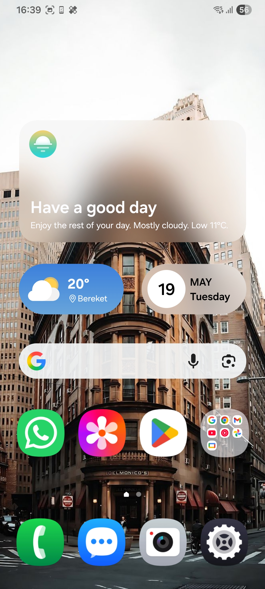
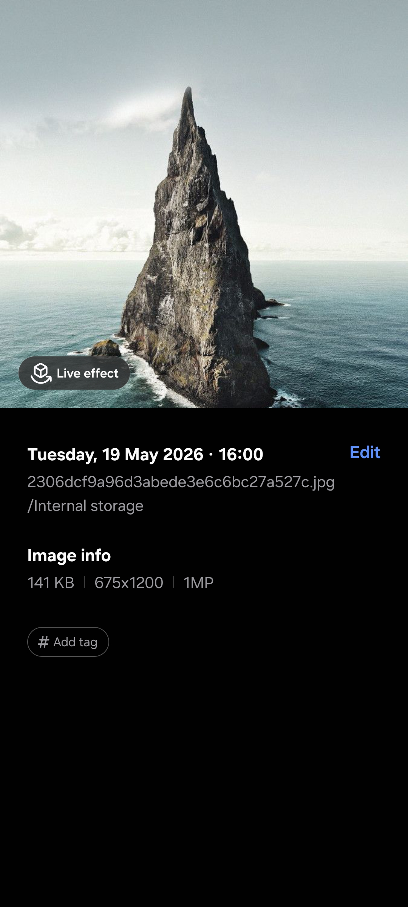
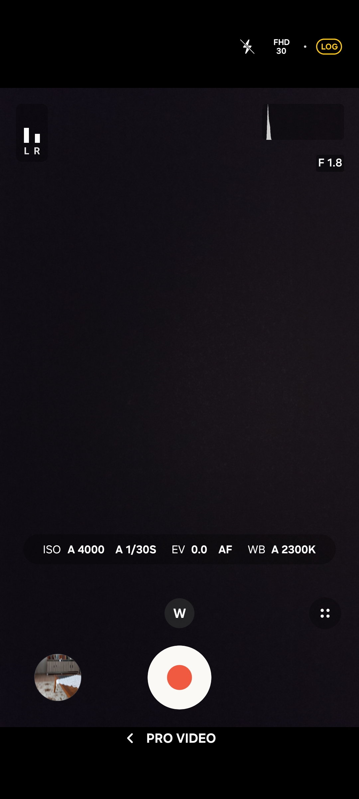
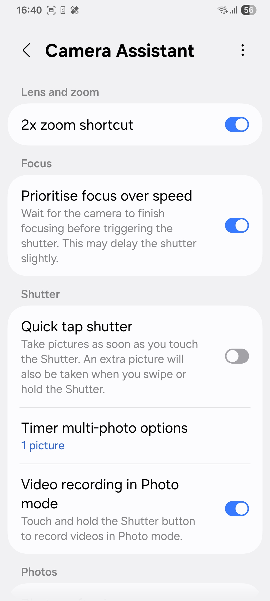
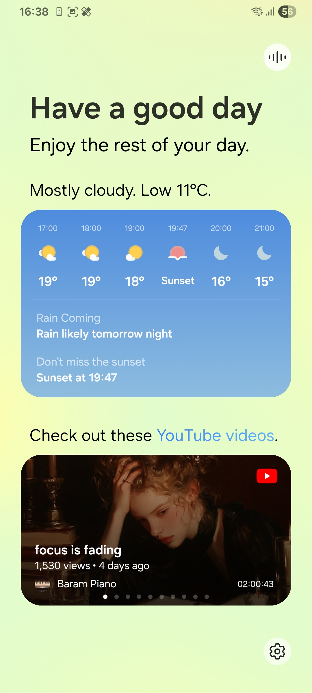
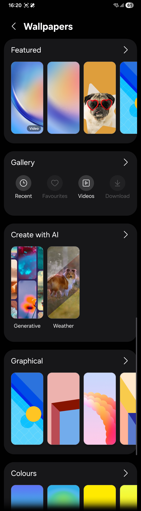
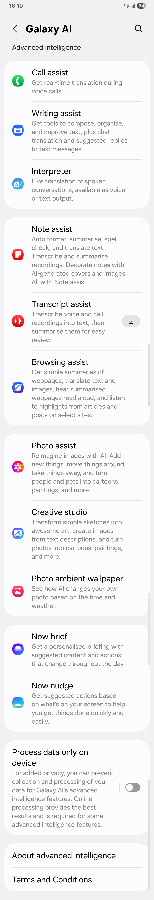

# A32-Feature-Adder-For-One-Ui-8

"A comprehensive Magisk module designed for Samsung A32 to unlock premium One UI features, fix common camera bugs, and optimize hardware performance."

---

## 🚀 Features

### 📸 Camera & Gallery Enhancements
| Feature | Description | Status |
| :--- | :--- | :--- |
| **S26 AI Port** | Premium AI features ported directly from the S26 series | ✅ Working |
| **Histogram** | Real-time light and exposure monitoring in camera preview | ✅ Added |
| **Pro Video Mode** | Full manual video controls, unlocking professional **Log Video** recording | ✅ Added |
| **Camera Assistant** | Advanced camera customization, shutter speed tuning, and auto-lens switching control | ✅ Working |
| **Live Effect** | Cinematic 3D depth and background effects applied directly to photos in Gallery | ✅ Enabled |

### 🤖 Galaxy AI Suite
* **Photo Ambient Wallpaper:** Full advanced climate and time-reflective wallpaper effects unlocked.
* **AI Wallpaper:** Generative AI wallpaper creation engine enabled natively.

### 📺 System & Display Optimizations
* **UI Enhancements:** Added **Now Brief**  from the S26 Ultra.
* **Enhanced Video & Media Playback:** Unlocked advanced media rendering and Natural Color Profiles for sharper, more vivid video playback with richer contrast.
* **Pro Display Calibration:** Enabled advanced Natural Color Profiles and hardware-level smart dimming to reduce eye strain in low-light environments.

## 📸 Screenshots

<table border="0" width="100%" cellpadding="0" cellspacing="0">
  <tr>
    <td width="25%" align="center"></td>
    <td width="25%" align="center"></td>
    <td width="25%" align="center"></td>
    <td width="25%" align="center"></td>
  </tr>
  <tr>
    <td width="25%" align="center"></td>
    <td width="25%" align="center"></td>
    <td width="25%" align="center"></td>
    <td width="25%"></td>
  </tr>
</table>
---
### 🎭 Core Injection
* **S26 Ultra Spoofing:** Integrated flagship system identity spoofing to bypass Samsung server restrictions, unlocking premium Galaxy AI and exclusive application features.

---

## 🛠️ Installation & Prerequisites

### Requirements
* **Device:** Samsung Galaxy A32 (A325F)
* **OS:** One UI 8.0 Custom ROM (e.g., LumiROM 8.3.1 base recommended)
* **Root:** Magisk 30.0+ installed

### 📥 Installation Steps
1. Download the latest `.zip` file from the [Releases](https://github.com/NOONE-8/A32-Feature-Adder-For-One-Ui-8/releases) section.
2. Open the **Magisk App** on your device.
3. Go to the **Modules** tab.
4. Click **Install from storage** and select the downloaded `.zip` file.
5. Once the flashing process is complete, reboot your device.

---

## ⚠️ Known Issues & Disclaimers
* **Compatibility:** Designed and tested explicitly for One UI 8.0. Using this module on older bases (like One UI 7.0 or below) might lead to unstable behavior, system UI loops, or camera app crashes.
